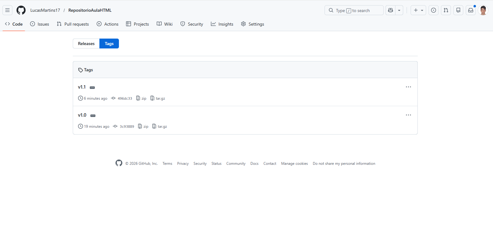
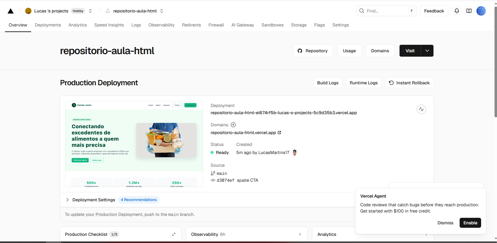
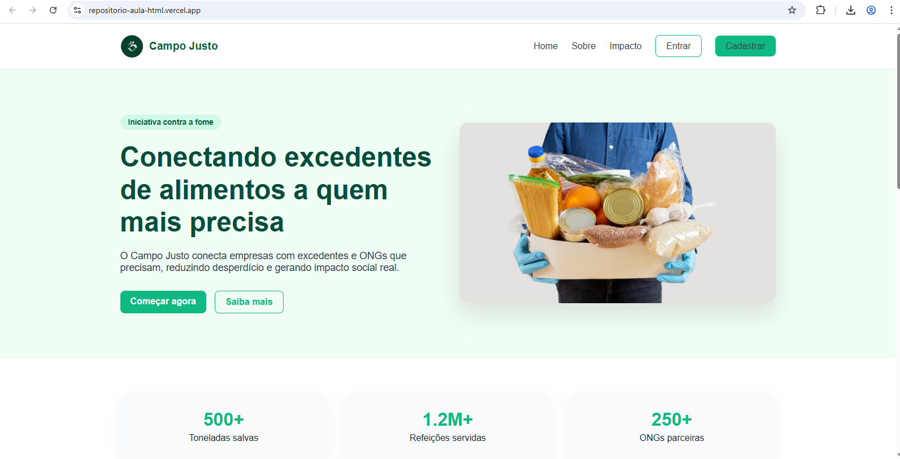

# 🌱 Campo Justo

Projeto de uma página web desenvolvida com HTML e CSS, utilizando versionamento com Git e GitHub e deploy realizado na plataforma Vercel.

O objetivo do projeto é demonstrar, na prática, o uso de controle de versões, tags de versão e publicação de um site estático, além de apresentar uma proposta de impacto social voltada à redução do desperdício de alimentos.

---

## 🚀 Tecnologias Utilizadas

- HTML5  
- CSS3  
- Git  
- GitHub  
- Vercel  

---

## 🎨 Design e Personalização

O layout do site foi desenvolvido com foco em simplicidade, clareza e impacto visual. As cores em tons de verde foram escolhidas para representar sustentabilidade, responsabilidade social e meio ambiente.

A estrutura do site é composta por:
- Cabeçalho com navegação
- Seção principal (Hero)
- Métricas de impacto
- Seção de processo (empresas e ONGs)
- Chamada para ação (CTA)
- Rodapé informativo

Na versão **v1.1**, foram realizados ajustes visuais, como:
- Aumento do tamanho das imagens da seção “Para empresas” e “Para ONGs”
- Refinamento do layout geral
- Melhor organização dos elementos visuais

---

## 🔄 Versionamento com Git

O projeto foi versionado utilizando Git, com o repositório hospedado no GitHub.

As seguintes versões foram marcadas utilizando tags:

- **v1.0** – Versão inicial do projeto  
- **v1.1** – Ajustes visuais e melhorias no layout  

### 📸 Visão geral do repositório

### 📸 Tags de versão

---

## 🚀 Deploy no Vercel

O deploy do projeto foi realizado na plataforma Vercel, com integração direta ao repositório do GitHub.

Etapas do processo:
- Conexão da conta do Vercel com o GitHub
- Seleção do repositório do projeto
- Deploy automático da aplicação
- Atualizações automáticas a cada novo push

### 📸 Dashboard do Vercel

### 🌐 Site publicado

---

## 🔗 Links do Projeto

- 🔗 **Repositório GitHub:**  
  https://github.com/LucasMartins17/RepositorioAulaHTML.git
- 🌐 **Site publicado no Vercel:**  
  https://repositorio-aula-html.vercel.app/

---

## ✅ Conclusão

Este projeto permitiu aplicar na prática os conceitos de versionamento de código, organização de repositórios e deploy de aplicações web. O uso do GitHub em conjunto com o Vercel facilitou o controle de versões e a publicação do site, garantindo acesso online e histórico de alterações.
